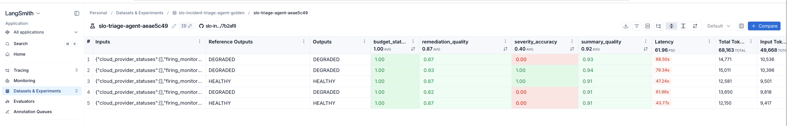
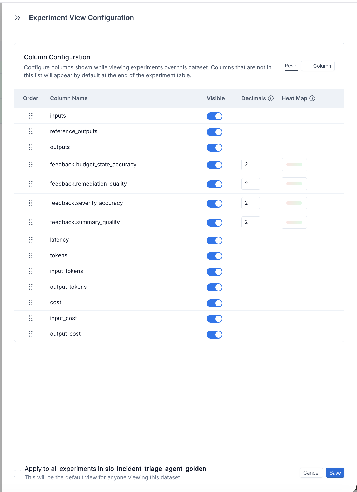

# Friction Log

Items are logged chronologically as discovered during development.
Each item includes the discovery context and a suggested improvement.

---

## Friction #1 — Azure status granularity requires authentication

**Discovery:** During design of the cloud provider status check node (ADR-009).

**Problem:** AWS and GCP provide unauthenticated public JSON feeds with
regional granularity:
  AWS: https://status.aws.amazon.com/data.json
  GCP: https://status.cloud.google.com/incidents.json

Azure's equivalent (Resource Health Events API) requires a Subscription
ID or Tenant ID, making it unavailable for unauthenticated public status
checks:
  GET https://management.azure.com/subscriptions/{subscriptionId}/
      providers/Microsoft.ResourceHealth/events
      ?api-version=2022-10-01&$filter=region eq 'East US'

Azure's public status page (azure.status.microsoft) exists but provides
only coarse-grained status without programmatic regional filtering.
This asymmetry across providers is undocumented and only discoverable
through trial and error.

**v1 approach:** Azure status returns UNKNOWN with a note explaining
the authentication requirement.

**Production path:** Azure Resource Health API with managed identity
authentication — no API key required if running inside Azure infrastructure.

**Suggested improvement:** Azure should expose an unauthenticated public
JSON endpoint with regional granularity equivalent to AWS and GCP, or
at minimum clearly document the gap and the managed identity path for
developers building multi-cloud status checkers.

---

## Friction #2 — SLO Burn Rate is not a universal monitoring concept

**Discovery:** During payload schema design (ADR-010).

**Problem:** The agent's core reasoning depends on SLO burn rate as an
input field. Burn rate is a native first-class concept in Datadog and
is well-defined in Google SRE methodology, but is not universally
available across monitoring providers:

  Datadog       native burn rate in webhook payload
  Prometheus    no native SLO concept — requires pyrra or sloth
                to calculate burn rate as a separate layer
  Grafana       SLO plugin available but relatively new
  New Relic     payload is customer-defined — burn rate inclusion
                depends on template configuration
  PagerDuty     incident management only, no native SLO concept

A developer integrating a non-Datadog provider will hit this gap
immediately and may not know that burn rate calculation is their
responsibility before calling /triage.

**Impact:** Without burn rate, the agent's assess_slo_impact node
cannot calculate time_to_exhaustion or budget_state, and
triage_firing_signals receives incomplete context, degrading
reasoning quality.

**v1 approach:** Burn rate is a required field in the payload schema.
The source of the burn rate calculation is explicitly out of scope —
the agent does not care who calculated it.

**Prometheus path (documented helper):**
  1. Deploy pyrra or sloth alongside Prometheus
       pyrra:  https://github.com/pyrra-dev/pyrra
       sloth:  https://github.com/slok/sloth
  2. Both tools calculate burn rate from Prometheus metrics
     and expose it as a queryable metric
  3. Configure Alertmanager to include burn rate in the
     webhook payload annotations before calling /triage

**Suggested improvement:** LangChain / LangGraph documentation for
agent design should explicitly note when a domain concept (like
SLO burn rate) is provider-specific and suggest normalization
strategies for teams using alternative providers.

---

## Friction #3 — New Relic has no canonical webhook payload format

**Discovery:** During ADR-010 provider research.

**Problem:** Unlike Datadog, Prometheus, and Grafana — which have
documented, consistent webhook payload formats — New Relic's webhook
payload is fully customer-defined via Handlebars message templates.
There is no canonical fixed format to write a translation table against.
Every New Relic customer's payload looks different depending on how
they configured their workflow notification template.

**Impact:** A developer integrating New Relic cannot follow a
documented translation table. They must either configure their
New Relic webhook template to match the agent's external schema,
or rely on the normalize_incident LLM node to resolve unknown values.

**Reference:** New Relic notification message templates documentation:
https://docs.newrelic.com/docs/alerts/get-notified/message-templates/

**Suggested improvement:** New Relic should provide a documented
canonical payload format for SLO/alert webhook integrations, similar
to Datadog's webhook payload reference. The current Handlebars
template approach gives flexibility but sacrifices interoperability.
---

## Friction #4 — Tag ownership inference requires human judgment
             at scale — offloaded to Claude

**Discovery:** During state design — RemediationStep ownership model.

**Problem:** In large organizations, monitors accumulate tags over years
of ownership changes, team reorganizations, and inconsistent tagging
conventions. A single monitor may have:

  team:payments                        original owner
  team:backoffice                      current consumer
  notify:@old-team-dl@company.com      stale distribution list
  owner:platform-team                  added during reliability audit
  pagerduty:checkout-escalation        routing from 2 reorgs ago

No deterministic rule can reliably identify the correct escalation
path from this tag soup. A senior SRE uses judgment — reading the
full context of the monitor, its service, and the notification
literals to infer who actually owns it today.

**Impact:** Rules-based ownership resolution fails silently in large
organizations. The wrong team gets paged, or no one gets paged, and
the incident escalates unnecessarily.

**v1 approach:** Claude infers responsible teams and downstream impact
from all available tag values and notification literals (owner:, team:,
notify:, pagerduty:, downstream:, email addresses, Slack handles)
without requiring a rigid tag schema. The draft_summary surfaces the
inferred ownership and available tag evidence so the on-call engineer
can apply their own judgment.

**Consequence:** Ownership inference quality depends on tag richness.
Sparse or stale tags produce weaker ownership recommendations.

**Suggested improvement:** LangGraph / LangSmith documentation should
include a pattern for LLM-assisted metadata inference from unstructured
or inconsistent tag sets — this is a common enterprise reliability
engineering problem with no deterministic solution.

---

## Friction #5 — POST /triage payload requires pre-assembly that monitoring webhooks do not provide natively

**Discovery:** During api.py design review.

**Problem:** The /triage endpoint expects a fully assembled incident
payload including the SLO state, all firing monitors, and all quiet
monitors in a single request. A raw Datadog SLO webhook fires when
the burn rate is breached but provides only the SLO alert context —
it does not include constituent monitor states.

Assembling the full payload requires:
  1. Receiving the SLO burn rate alert from Datadog
  2. Querying the Datadog API for constituent monitor states
  3. Identifying which monitors are firing vs. healthy
  4. Bundling SLO + firing monitors + quiet monitors into the schema
  5. POSTing the assembled payload to /triage

This assembly step is not provided by any monitoring webhook natively.
A developer integrating this agent with a real monitoring system will
hit this gap immediately.

**v1 approach:** Pre-assembled synthetic fixture files in
data/incidents/ simulate the assembled payload. No enrichment
service is needed for development and evaluation.

**Production path:** A webhook enrichment service sits between
the monitoring system and /triage:
  Datadog SLO alert -> enrichment service -> assembled payload -> /triage

The enrichment service queries the Datadog API (or equivalent) for
monitor states and assembles the full incident payload before
forwarding to the agent.

**Suggested improvement:** LangChain documentation for incident
management agent patterns should explicitly document the enrichment
layer requirement. The gap between "raw monitoring webhook" and
"fully assembled incident context" is non-obvious and represents
significant integration work for production deployments.

---

## Friction #6 — LangSmith Applications do not scope datasets

**Discovery:** During evals/run_evals.py setup and LangSmith UI navigation.

**Problem:** Datasets in LangSmith are workspace-level, not Application-level.
When working inside an Application context, the Datasets & Experiments
tab shows an empty "create a dataset" prompt rather than the datasets
associated with that Application's experiments. This is confusing — a
developer building an agent expects all evaluation artifacts to be
grouped under the Application they created for that project.

The dataset created by run_evals.py exists at the workspace level and
is only accessible at smith.langchain.com/datasets, not from within
the Application view.

**Impact:** A developer following the "create an Application first"
workflow (which LangSmith recommends to avoid trace migration issues)
will not find their evaluation datasets inside the Application. The
connection between Application traces and workspace-level datasets is
not surfaced in the UI.

**Suggested improvement:** LangSmith should either scope datasets to
Applications or clearly surface the relationship between Application
traces and workspace-level evaluation datasets from within the
Application view.

---

## Friction #7 — LangSmith heat map colors require manual configuration and page reload

**Discovery:** During first evaluation run review in LangSmith UI.

**Problem:** After running evaluate() and viewing results, score columns
show plain numbers with no color coding. Color coding requires:

  1. Opening the Experiment View Configuration panel (not obvious)
  2. Clicking the Heat Map swatch for each feedback column individually
  3. Verifying "Enable colors" is toggled ON per column
  4. Checking "Apply to all experiments" before saving (easy to miss)
  5. Navigating away and back to the experiment for colors to render

None of these steps are documented in the evaluate() quickstart guide.
A developer running their first evaluation expects color coding to appear
automatically based on the 0-1 score scale.

Additionally, there is no programmatic way to configure heat map settings
from the SDK — it must be done manually in the UI per dataset, and the
configuration does not persist automatically across new datasets.

**Workaround:** After enabling heat map colors, toggle "Higher = better" 
off and back on for each feedback column before saving. Simply enabling 
the heat map toggle without making an additional change does not trigger 
the color rendering. The state change on any setting forces the 
configuration to apply correctly.

**Impact:** First-time users will see plain number scores and assume color
coding is not supported, missing a key feature of the evaluation UI.

**Suggested improvement:** LangSmith should apply default heat map
coloring automatically for any feedback score in the 0.0-1.0 range,
with the option to customize thresholds. The current manual configuration
requirement creates unnecessary friction for the most common use case.

**Screenshots:**

Column Configuration panel — heat map toggle per feedback column:

Heat Map configuration popup — Enable colors + threshold settings:

