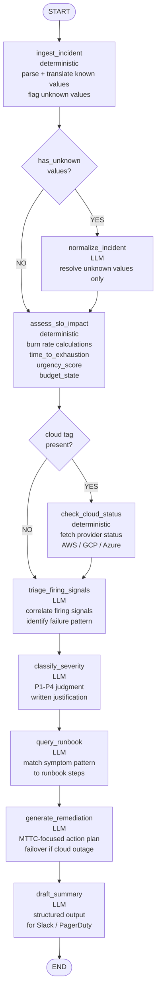
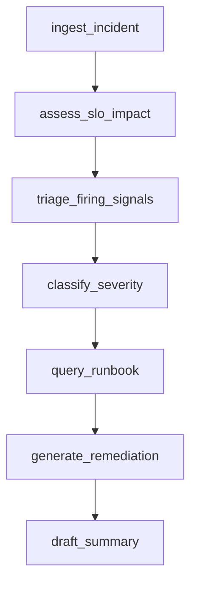
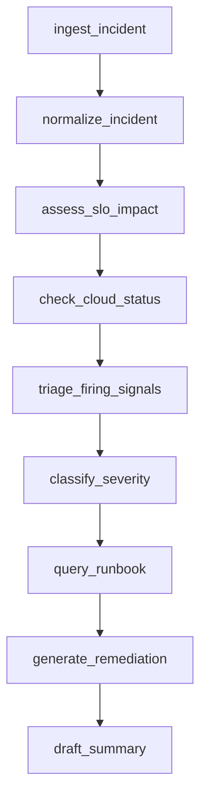

# slo-incident-triage-agent

A LangGraph agent that triages SLO burn rate incidents by reasoning over
correlated APM golden signals, synthetics, and monitor states to classify
severity and generate remediation recommendations.

The agent is implemented as an HTTP service (FastAPI) that receives
incident payloads via POST /triage. It is provider-agnostic at the
transport layer — any monitoring system that calculates SLO burn rate
and constituent monitor states can integrate by conforming to the
payload schema.

---

## Architecture

### Full Graph Topology



### Happy Path (7 nodes — known provider, no cloud tag)



### Full Path (9 nodes — unknown provider + cloud tag present)



---

## Provider Agnosticism

The agent accepts a normalized incident payload modeled on Datadog
monitor-based SLO webhooks. Any monitoring system that calculates
SLO burn rate and constituent monitor states can integrate by
conforming to the payload schema.

SLO burn rate is a required field. Provider-specific paths:

- **Datadog** — native burn rate available in SLO webhook payload
- **Prometheus** — requires pyrra or sloth to calculate burn rate
  - [pyrra](https://github.com/pyrra-dev/pyrra)
  - [sloth](https://github.com/slok/sloth)
- **Grafana** — available if Grafana SLO plugin is configured
- - **Providers with configurable payloads** (e.g. New Relic) — configure your webhook template to match the external schema, or rely on the conditional normalize_incident node to resolve unknown values automatically

See [ADR-010](docs/adr/ADR-010-payload-schema-design.md) for the
full payload schema and provider translation tables.

---

## Project Structure

```
slo-incident-triage-agent/
├── .env.example              # template for required env vars
├── .python-version           # pyenv pin (3.11.9)
├── pyproject.toml            # poetry config and dependencies
├── poetry.lock               # locked dependency versions
├── README.md                 # setup + architecture docs
├── Makefile                  # common commands
├── FRICTION_LOG.md           # developer experience notes
├── agent/
│   ├── __init__.py
│   ├── state.py              # IncidentState TypedDict
│   ├── nodes.py              # node implementations (TBD)
│   ├── graph.py              # LangGraph wiring (TBD)
│   ├── tools.py              # runbook lookup tool (TBD)
│   ├── api.py                # FastAPI /triage endpoint (TBD)
│   └── main.py               # CLI entry point (TBD)
├── data/
│   └── incidents/            # incident fixture files (TBD)
├── evals/
│   └── run_evals.py          # LangSmith evaluate() (TBD)
├── tests/                    # unit tests (TBD)
└── docs/
    └── adr/
        ├── ADR-000-project-overview.md
        ├── ADR-001-python-version.md
        ├── ADR-002-poetry.md
        ├── ADR-003-llm-provider.md
        ├── ADR-004-langgraph-vs-vendor-frameworks.md
        ├── ADR-005-fastapi-webhook-service.md
        ├── ADR-006-deterministic-vs-llm-nodes.md
        ├── ADR-007-tag-normalization.md
        ├── ADR-008-historical-pattern-detection.md
        ├── ADR-009-cloud-provider-status-check.md
        ├── ADR-010-payload-schema-design.md
        └── ADR-011-graph-topology.md
```

---

## Prerequisites

- [pyenv](https://github.com/pyenv/pyenv)
- [Poetry](https://python-poetry.org/) 2.x
- Python 3.11.9
- Anthropic API key — [console.anthropic.com](https://console.anthropic.com)
- LangSmith API key — [smith.langchain.com](https://smith.langchain.com)
- Docker Desktop
- minikube

---

## Setup

```bash
git clone git@github.com:navarra-lisandro/slo-incident-triage-agent.git
cd slo-incident-triage-agent
python --version        # should show 3.11.9
poetry install
cp .env.example .env    # add your API keys
```

---

## Usage

```bash
make serve              # run FastAPI service locally
make run                # run CLI entry point
make lint               # run ruff linter
make test               # run pytest
make eval               # run LangSmith evaluation
```

---

## ADRs

All architectural decisions are documented in [docs/adr/](docs/adr/).
Start with [ADR-000](docs/adr/ADR-000-project-overview.md) for the
full project rationale.
