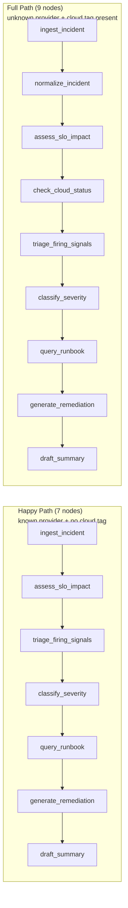

# ADR-011: Graph Topology

## Status
Accepted

## Context
The agent is implemented as a LangGraph state machine. The graph
topology — nodes, edges, and conditional routing — is the core
architectural decision that determines how the agent reasons over
an incident payload. This ADR documents the topology, the rationale
for each node, and the two conditional edges that produce different
execution paths depending on payload content.

## Decision
The agent graph has a maximum of 9 nodes with 2 conditional edges.
The happy path (known provider, no cloud tag) executes 7 nodes.
The full path (unknown provider values + cloud tag present) executes
all 9 nodes.

## Full Graph Topology

```mermaid
flowchart TD
    START([START]) --> ingest_incident

    ingest_incident["ingest_incident\ndeterministic\nparse + translate known values\nflag unknown values"]
    ingest_incident --> has_unknown{has_unknown\nvalues?}

    has_unknown -->|YES| normalize_incident
    has_unknown -->|NO| assess_slo_impact

    normalize_incident["normalize_incident\nLLM\nresolve unknown values only"]
    normalize_incident --> assess_slo_impact

    assess_slo_impact["assess_slo_impact\ndeterministic\nburn rate calculations\ntime_to_exhaustion\nurgency_score\nbudget_state"]
    assess_slo_impact --> cloud_tag{cloud tag\npresent?}

    cloud_tag -->|YES| check_cloud_status
    cloud_tag -->|NO| triage_firing_signals

    check_cloud_status["check_cloud_status\ndeterministic\nfetch provider status\nAWS / GCP / Azure"]
    check_cloud_status --> triage_firing_signals

    triage_firing_signals["triage_firing_signals\nLLM\ncorrelate firing signals\nidentify failure pattern\nstructured + narrative output"]
    triage_firing_signals --> classify_severity

    classify_severity["classify_severity\nLLM\nP1-P4 judgment\nwritten justification"]
    classify_severity --> query_runbook

    query_runbook["query_runbook\nLLM\nmatch symptom pattern\nto runbook steps"]
    query_runbook --> generate_remediation

    generate_remediation["generate_remediation\nLLM\nMTTC-focused action plan\nincludes failover if\ncloud outage confirmed"]
    generate_remediation --> draft_summary

    draft_summary["draft_summary\nLLM\nstructured output\nfor Slack / PagerDuty"]
    draft_summary --> END([END])
```

## Happy Path vs Full Path

## Node Rationale

### ingest_incident (deterministic)
Entry point for all payloads. Parses the raw payload, applies the
translation table for known provider values (ADR-010), unifies tags
into dict[str, list[str]] (ADR-007), and flags unknown values without
halting the graph.

### normalize_incident (conditional LLM)
Only invoked when ingest_incident flags unknown values. Claude resolves
ambiguous or novel field values to canonical schema values. Skipped
entirely on the happy path — zero token cost for known providers.
See ADR-006 for the deterministic vs LLM separation rationale.

### assess_slo_impact (deterministic)
Pure arithmetic. Calculates time_to_exhaustion_minutes, urgency_score,
and budget_state from burn rate and error budget fields. These derived
values give Claude precise, pre-calculated context for downstream
reasoning. See ADR-006.

### check_cloud_status (conditional deterministic)
Only invoked when a cloud:* tag is present in unified_tags. Fetches
the provider status feed for each cloud tag value (AWS, GCP, Azure)
and writes CloudProviderStatus objects to state. Skipped when no
cloud tag is present. See ADR-009.

### triage_firing_signals (LLM)
First Claude reasoning node. Receives the full normalized state
including derived metrics and cloud provider status. Produces a
per-signal structured assessment, identifies the cross-signal failure
pattern, and writes a correlation narrative. See ADR-006.

### classify_severity (LLM)
Receives signal correlation output and full state context. Produces
a P1-P4 classification with written justification. Cloud provider
outage informs but never caps severity. See ADR-009.

### query_runbook (LLM)
Matches the service name, signal pattern, and failure pattern to
the appropriate runbook steps. Returns a prioritized list of
diagnostic and remediation steps.

### generate_remediation (LLM)
Synthesizes a MTTC-focused action plan from all upstream context.
When a cloud provider outage is confirmed, explicitly includes
failover and degradation options the team controls. See ADR-009.

### draft_summary (LLM)
Produces the final structured incident summary ready for
Slack or PagerDuty consumption. Surfaces normalization_warnings
if any values were flagged during ingestion. Includes all key
fields: severity, justification, firing signals, cloud impact,
recommended steps, and narrative summary.

## Conditional Edge Rationale

### Edge 1 — has_unknown_values
Keeps the common case (known provider) on the fast deterministic
path. The LLM normalization cost is only incurred when genuinely
needed. This is the designed exception to ADR-006's deterministic
first principle.

### Edge 2 — cloud tag present
Cloud status checks are live HTTP calls with latency implications.
Skipping them when no cloud tag is present keeps the happy path
fast and avoids unnecessary external network calls.

## Consequences
- The graph has two distinct execution paths — LangSmith traces
  will show which path was taken on every run
- Happy path has zero conditional LLM calls — deterministic from
  ingest through assess, then LLM reasoning begins at triage
- Full path adds normalize_incident and check_cloud_status —
  both are traceable and independently evaluable in LangSmith
- Adding a new conditional node requires updating this ADR,
  the state schema, and the graph wiring in graph.py
- The Mermaid diagrams in this ADR are the authoritative topology
  record — the README contains the same diagrams for visibility
